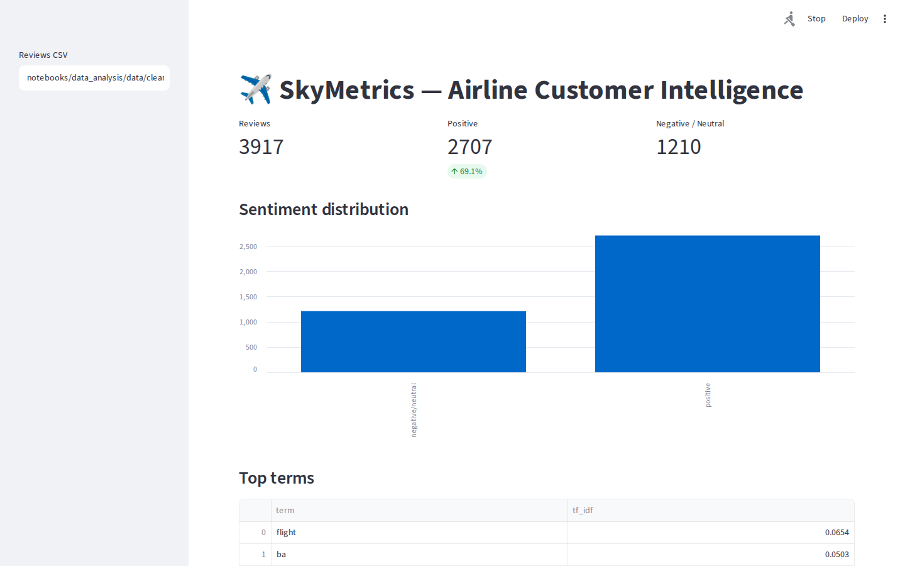
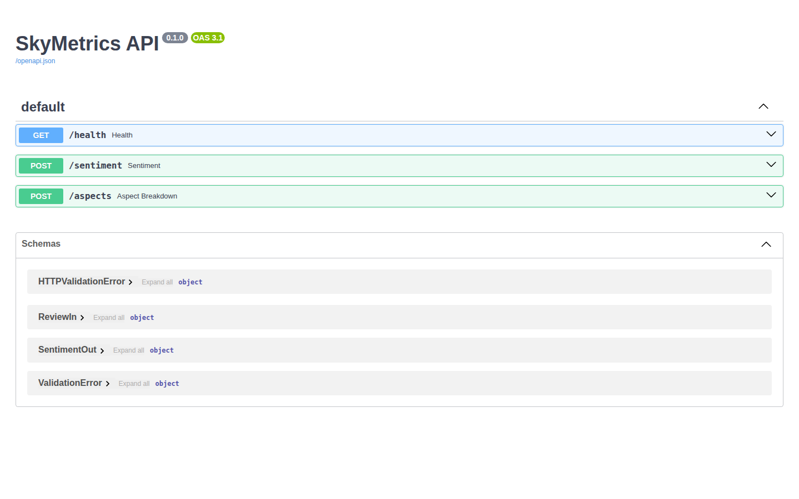
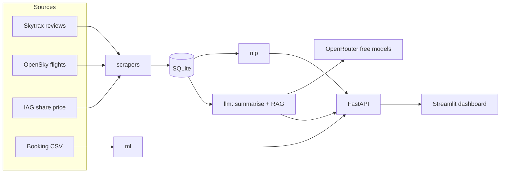

<div align="center">

# ✈️ SkyMetrics

**An airline customer-intelligence platform for British Airways — review sentiment, aspect analysis, booking prediction, live flight tracking and an AI chatbot, in one tested product.**

[](https://github.com/Gauthambinoy20/SkyMetrics/actions/workflows/ci.yml)
[](https://github.com/Gauthambinoy20/SkyMetrics/actions/workflows/codeql.yml)
[](https://python.org)
[](LICENSE)

[**Quick Start**](#quick-start) · [**Architecture**](docs/architecture.md) · [**Report a bug**](https://github.com/Gauthambinoy20/SkyMetrics/issues)

</div>



---

## About

Airlines sit on a flood of public customer feedback but rarely turn it into decisions. SkyMetrics ingests British Airways review data, scores it (sentiment, service aspects, topics), predicts whether a customer will complete a booking, enriches it with **live flight positions** and the parent company's share price, and lets you **ask questions of the reviews in natural language**. It began as the British Airways Data Science Virtual Experience (Forage) and was expanded into a fully tested, containerised product with an API, a dashboard and a CI/CD pipeline.

---

<details>
<summary><b>Table of Contents</b></summary>

- [Features](#features)
- [Screenshots](#screenshots)
- [Quick Start](#quick-start)
- [Configuration](#configuration)
- [Usage](#usage)
- [Project Structure](#project-structure)
- [Architecture](#architecture)
- [Tech Stack](#tech-stack)
- [Key Technical Decisions](#key-technical-decisions)
- [Testing](#testing)
- [Deployment & Scaling](#deployment--scaling)
- [Roadmap](#roadmap)
- [What I'd Do Differently](#what-id-do-differently)
- [License](#license)
- [Acknowledgements](#acknowledgements)

</details>

---

## Features

- **Sentiment analysis** — fast TextBlob baseline plus an optional DistilBERT transformer.
- **Aspect-based scoring** — per-topic sentiment for seat, food, staff, delay, baggage, value and wifi.
- **Topic mining** — TF-IDF ranking of the most distinctive review terms.
- **Booking prediction** — a Random Forest serving booking-completion probability over HTTP.
- **Live flight tracking** — airborne BA aircraft from the OpenSky Network, plotted on a map.
- **LLM review summariser** — top complaints, praises and a recommendation (OpenRouter free models).
- **RAG chatbot** — ask questions and get answers grounded in retrieved reviews, with citations.
- **Production hygiene** — 81 tests, Docker, and a full CI/CD pipeline, all green.

---

## Screenshots

| Dashboard | API (Swagger) |
|-----------|---------------|
|  |  |

| Sentiment distribution | SHAP feature attribution |
|------------------------|--------------------------|
|  |  |

---

## Quick Start

### Prerequisites
- Python >= 3.10 (developed on 3.12)
- Docker (optional, for the one-command setup)

### Install & Run
```bash
# 1. Clone
git clone https://github.com/Gauthambinoy20/SkyMetrics.git
cd SkyMetrics

# 2. Create a virtualenv and install
python -m venv .venv && source .venv/bin/activate
pip install -r requirements-dev.txt
pip install -e .

# 3. Set up environment
cp .env.example .env   # optional: add OPENROUTER_API_KEY for the LLM features

# 4. Run the API
uvicorn skymetrics.api.app:app --reload   # http://localhost:8000/docs

# 5. Run the dashboard (separate terminal)
streamlit run src/skymetrics/dashboard/app.py   # http://localhost:8501
```

### Run the tests
```bash
pytest --cov=skymetrics --cov-report=term-missing
```

> One-command setup: `docker compose up --build` starts the API (8000) and dashboard (8501) together.

To enable `/predict`, train the model once: `python scripts/train_model.py`.

---

## Configuration

| Variable | Description | Required | Default |
|----------|-------------|----------|---------|
| `OPENROUTER_API_KEY` | Enables `/summary` and `/chat` (free models) | No¹ | — |
| `SKYMETRICS_MODEL_PATH` | Path to the trained booking model | No | `models/booking.joblib` |
| `OPENSKY_USERNAME` / `OPENSKY_PASSWORD` | Higher OpenSky rate limits | No | — |
| `SKYMETRICS_DB_URL` | SQLite connection string | No | `sqlite:///skymetrics.db` |
| `API_HOST` / `API_PORT` | API bind address | No | `0.0.0.0` / `8000` |

¹ LLM endpoints return `503` until a key is set. Full list in [`.env.example`](.env.example).

---

## Usage

Predict booking completion:
```bash
curl -X POST http://localhost:8000/predict -H "Content-Type: application/json" \
  -d '{"num_passengers":2,"purchase_lead":80,"length_of_stay":5,"flight_hour":9,
       "flight_day":"Mon","route":"AKLDEL","booking_origin":"India","trip_type":"RoundTrip",
       "sales_channel":"Internet","wants_extra_baggage":1,"wants_preferred_seat":1,
       "wants_in_flight_meals":1,"flight_duration":7.0}'
```
```json
{ "booking_complete": 0, "probability": 0.46 }
```

Ask the reviews (RAG):
```bash
curl -X POST http://localhost:8000/chat -H "Content-Type: application/json" \
  -d '{"question":"What do customers say about the food?","reviews":["The meal was cold","Great catering"]}'
```
```json
{ "answer": "...", "sources": ["Great catering", "The meal was cold"] }
```

| Method | Path | Purpose |
| --- | --- | --- |
| GET | `/health` | liveness |
| POST | `/sentiment` | baseline polarity + label |
| POST | `/aspects` | per-aspect sentiment |
| GET | `/flights/live` | airborne BA flights (OpenSky) |
| POST | `/predict` | booking-completion prediction |
| POST | `/summary` | LLM summary of reviews |
| POST | `/chat` | grounded RAG answer over reviews |

---

## Project Structure

```
.
├── src/skymetrics/
│   ├── api/          # FastAPI app and endpoints
│   ├── nlp/          # sentiment, aspects, topics, transformer
│   ├── ml/           # booking model, predict, importance, model card, persistence
│   ├── llm/          # OpenRouter client, summariser, RAG retriever
│   ├── scrapers/     # Skytrax reviews, OpenSky flights, IAG share price
│   ├── db/           # SQLite schema and loaders
│   └── dashboard/    # Streamlit app and pure data-prep
├── tests/            # 81 unit tests (network and LLM mocked)
├── scripts/          # train_model.py
├── notebooks/        # original BA Forage notebooks + data
├── docs/             # architecture diagrams and screenshots
├── ANALYSIS_OUTPUT/  # rendered analysis charts
└── docker-compose.yml
```

---

## Architecture



Data flows from public sources through the scrapers into SQLite; the NLP, ML and LLM layers read from there and are served by FastAPI, which the Streamlit dashboard consumes. Full set of diagrams (architecture, data-flow, sequence, ER) in [docs/architecture.md](docs/architecture.md).

---

## Tech Stack

- **API:** FastAPI, Pydantic, Uvicorn
- **ML:** scikit-learn, XGBoost, TensorFlow/Keras, SHAP, joblib
- **NLP:** TextBlob, NLTK, HuggingFace Transformers (optional), TF-IDF
- **AI/LLM:** OpenRouter (free models), TF-IDF retrieval for RAG
- **Data:** pandas, SQLite, BeautifulSoup, requests; OpenSky + Yahoo Finance APIs
- **Dashboard:** Streamlit, matplotlib
- **Infra & quality:** Docker, GitHub Actions (CI, CodeQL, Dependabot), ruff, mypy, bandit, pip-audit, gitleaks, Trivy, pytest

---

## Key Technical Decisions

| Decision | Why | Trade-off accepted |
|----------|-----|--------------------|
| SQLite (stdlib) over Postgres | Zero-dependency, portable, perfect for a single-node analytics tool | Single-writer; not for high write concurrency |
| TF-IDF retrieval for RAG (no vector DB) | Deterministic, fast on CPU, no embedding service or cost | Lexical match can miss paraphrase |
| OpenRouter free models for LLM | No API cost; swappable models | Rate limits and variable quality |
| TextBlob baseline + optional transformer | Instant startup; heavy model is opt-in | Baseline is less nuanced than the transformer |
| Slim container excludes TensorFlow/Jupyter | Small, fast image for the served apps | Notebooks need the full requirements |
| fetch/parse split in every scraper | Parsers are unit-tested; network is mocked | A little extra indirection |

---

## Testing

```bash
pytest --cov=skymetrics --cov-report=term-missing
```
81 unit tests across every module — covering happy paths and failure paths — with all network and LLM calls mocked, so the suite is free, fast and deterministic. Enforced in CI alongside ruff, mypy, bandit, pip-audit, gitleaks, Trivy and a Docker build.

---

## Deployment & Scaling

- **Deploy:** containerised; `docker compose up` runs the API and dashboard on any Docker host.
- **On a hyperscaler:** stateless API behind a load balancer, managed Postgres in place of SQLite, autoscaling on CPU.
- **Scaling plan:** move scraping/scoring to a scheduled worker (ETL), cache OpenSky/IAG calls, and add a vector store if retrieval recall becomes the bottleneck.

---

## Roadmap

- [x] Sentiment, aspect and topic analysis
- [x] Booking-completion model served via `/predict`
- [x] Live flight tracking + map
- [x] LLM summariser and RAG chatbot
- [ ] Trustpilot + Reddit scrapers
- [ ] Time-series sentiment trend + forecasting
- [ ] Scheduled ETL into the store

Full detail in [ROADMAP.md](ROADMAP.md).

---

## What I'd Do Differently

> ✍️ TODO: my words — real trade-offs, known limitations, and edge cases I'd revisit.

---

## License

Distributed under the MIT License. See [LICENSE](LICENSE).

---

## Acknowledgements

- British Airways Data Science Virtual Experience (Forage) — the original brief and datasets.
- [OpenSky Network](https://opensky-network.org) for live flight data.
- [Skytrax / airlinequality.com](https://www.airlinequality.com) review data.
