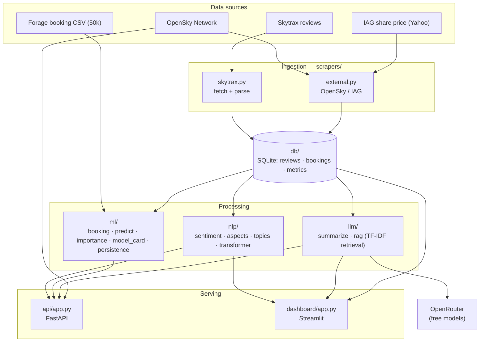
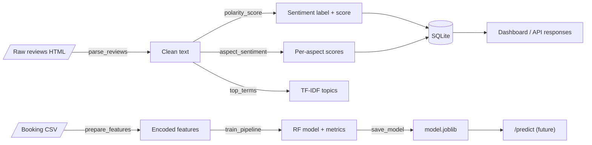
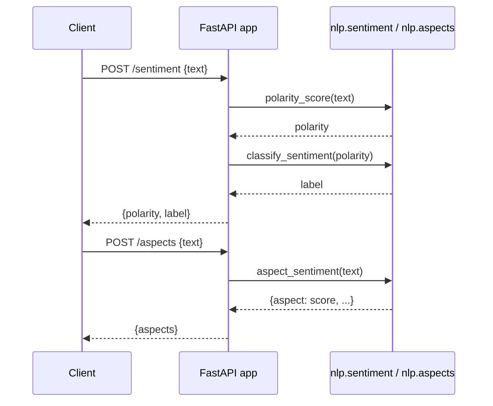
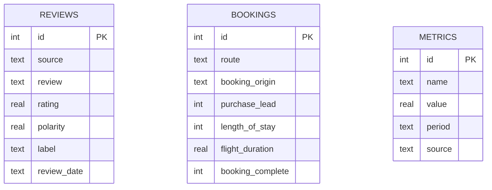

# SkyMetrics — Architecture

All diagrams are derived from the actual modules under `src/skymetrics/`.

## Component / architecture diagram

## Data flow diagram (DFD)

## Core sequence — review analysis request

## ER diagram — SQLite schema

